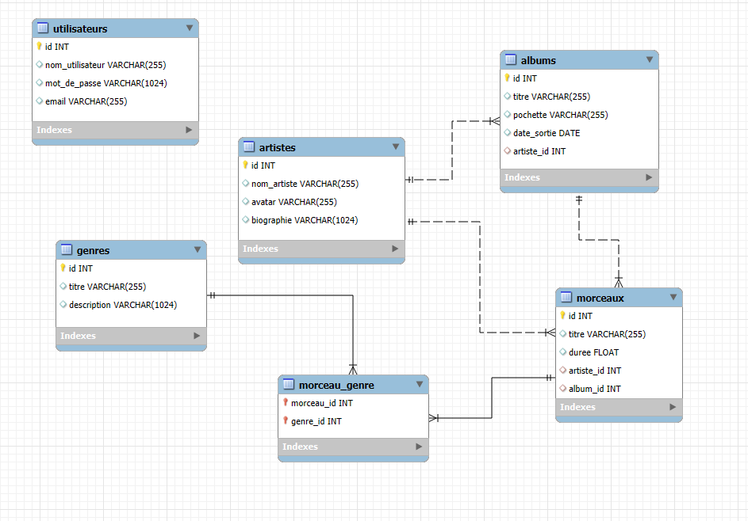

# Projet Spotilike

## 📂 Base de données

La base de données relationnelle est gérée via MySQL Workbench, version 8.0.

### 🗺️ Modèle de données (MPD)



### 📝 Scripts de données

Les scripts des jeux de données se trouvent dans le sous-dossier `db_data` lui-même dans le dossier `docs` du projet. Voici l'ordre recommandé pour leur exécution : 
1. artists.sql
2. genres.sql
3. albums.sql
4. morceaux.sql
5. morceau_genre.sql

Pour la gestion des images, une chaîne de caractères est utilisée pour stocker l'URLou le nom de l'image, bien que ces URLs ne soient pas présentes dans le jeu de données.

### ⚙️ Fichier de configuration

Le fichier de configuration de la base de données se situe dans `database.py`. Il est nécessaire de l'éditer pour l'adapter à votre environnement local.

---

## 🌐 API Rest

### Informations générales

L'API Rest est développée avec **FastAPI**. Les différents endpoints sont définis dans le dossier `routers`. Les schémas pour la mise à jour ou l'enregistrement des données se trouvent dans le dossier `schemas`.

### 🚀 Lancer l'API

Pour exécuter l'API, ouvrez un terminal et activez l'environnement de développement avec la commande suivante :

```
.venv\Scripts\activate
```

Exécuter ensuite la commande suivante pour lancer le run de l'API : 
```
uvicorn main:app --reload
```


Tous les modules nécessaires sont listés dans le fichier `requirements.txt` du dossier `Docs`.

## 🌍 Front-end

Le front-end est développé avec une stack technologique classique : **HTML**, **CSS**, **JavaScript**. Le CSS a été réalisé en grande partie à l'aide de Bootstrap et quelques classes définies dans le fichier `styles.css`. Tous les fichiers relatifs au front-end se trouvent dans le dossier `frontend`, avec des sous-dossiers pour les vues et les scripts.

### 🚀 Lancer le front-end

Lorsque vous ouvrez le projet dans **VS Code**, il suffit de démarrer le serveur via **Live Server** en étant sur la page `index.html`.

Vous pourrez ensuite naviguer entre les différentes pages grâce au menu de navigation.

### ⚙️ Fonctionnalités

Le front-end permet d'interagir avec tous les endpoints définis dans le back-end. Voici les objets que vous pouvez visualiser :

- **Albums**
- **Artistes**
- **Genres musicaux**
- **Morceaux**

Vous pouvez également éditer ces objets, à l'exception des morceaux.

La suppression est disponible pour les albums et les artistes, et supprimera en cascade les éléments associés. Pour utiliser cette fonctionnalité, vous devez d'abord vous enregistrer et vous identifier.

### 🔒 Authentification

L'authentification est classique. Si vous n'avez pas encore de compte, vous devrez en créer un via le formulaire sur la page **Sign up**, puis vous identifier via la page **Sign in**.

Les mots de passe sont stockés de manière sécurisée, sous forme hashée, dans la base de données.